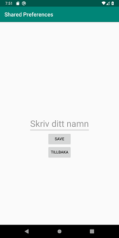

# Rapport

Tanken med appen är att spara en string från secondActivity och sedan presentera den i mainActivity genom att använda sig av shared preferences. 

Layouten för mainActivity är främst uppbyggd med en textView och en button. Första gången man öppnar appen kommer textViewen endast att innehålla ett heej, men genom att klicka på knappen kommer användaren till sida nummer två med hjälp av koden:
```
next.setOnClickListener(new View.OnClickListener() {
    @Override
    public void onClick(View view) {
        Intent i = new Intent(MainActivity.this, Second.class);
        startActivity(i);
    }
});
```
En Clicklistener aktiveras då man klickar på knappen som den hör till.

 
**Bild 1:** Startsida första gången man startar appen

När användaren skickats till nästa sida bes den att skriva in sitt namn i en editText. Då användaren klickar på spara-knappen sparas namnet som en string i våran shared preference:
```
EditText newPrefText=new EditText(this);
newPrefText=(EditText)findViewById(R.id.settingseditview);
myPreferenceEditor.putString("MyAppPreferenceString", newPrefText.getText().toString());
myPreferenceEditor.apply();
    ...
```


**Bild 2:** Andra sidan

När namnet har sparats kommer en textView som berättar för användaren att det angivna namnet har sparats:
```
TextView prefTextRef=new TextView(this);
prefTextRef=(TextView)findViewById(R.id.prefText);
prefTextRef.setText(myPreferenceRef.getString("MyAppPreferenceString", "No preference found.") + " ditt namn är nu sparat");
```


**Bild 3:** Sparat namn

Användaren kan sedan gå tillbaka till första sidan genom att klicka på knappen "tillbaka", då kommer det sparade namnet dyka upp i textViewen t.ex. "Heej Cazzie". Om användaren skulle vilja stänga ner appen efter den skrivit in sitt namn kommer appen att vid nästa gång den startas att komma ihåg användarens namn och kommer då presenterat det som tidigare beskrivits.
```
myPreferenceRef = getSharedPreferences("MyPreferencesName", MODE_PRIVATE);
myPreferenceEditor = myPreferenceRef.edit();

TextView prefTextRef=new TextView(this);
prefTextRef=(TextView)findViewById(R.id.prefText2);
prefTextRef.setText("Heeej "+ myPreferenceRef.getString("MyAppPreferenceString", "!"));
```


**Bild 4:** Om man går tillbaka eller startar appen på nytt
